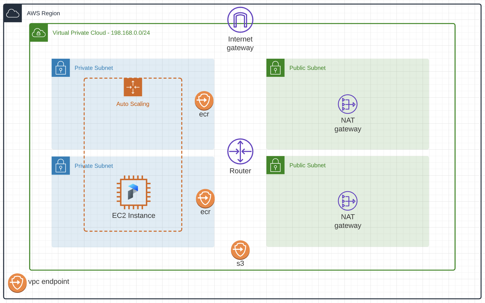

# Prefect Docker Agent on AWS EC2 Module

The [Prefect Agent](https://docs.prefect.io/orchestration/agents/overview.html) is a lightweight process that orchestrates [flow runs](https://docs.prefect.io/core/concepts/flows.html).  It is responsible for starting and monitoring flow runs. During operation the agent process queries the Prefect API for any scheduled flow runs, and allocates resources for them on their respective deployment platforms.

This Terraform module deploys the infrastructure required to run the Prefect Docker agent on AWS EC2. By default, it deploys AWS VPC Networking resources, which are best practice for Prefect configuration. You can disable the default networking as show in the [bring your own network](https://github.com/aws-ia/terraform-prefect-agent-ec2/tree/main/examples/bring-your-own-network) example.



## Prerequisites

1. Generate an [API service account key](https://docs.prefect.io/orchestration/concepts/api_keys.html#using-api-keys) for the agent
2. Store the API key in AWS Secrets Manager in the console, or using the following CLI command.  The secret is not created by this Terraform module intentionally, as Terraform would store the API key in plaintext within the state file.
```
aws secretsmanager create-secret --name prefect-api-key --secret-string "{\"key\":\"API_KEY_HERE\"}"
```
> Note - if you receive the following error from Terraform, the secret has not been created or the name of the secret provided to Terraform was incorrect.
```
Error: Secrets Manager Secret "prefect-api-key" not found
```

## Examples

Review the `examples/` directory for several specific deployment patterns:
* [Agent Configuration Options](https://github.com/aws-ia/terraform-prefect-agent-ec2/tree/main/examples/agent-configuration-options) - Demonstrates common agent configuration options that can be passed to the module
* [Additional IAM Permissions](https://github.com/aws-ia/terraform-prefect-agent-ec2/tree/main/examples/additional-iam-permissions) - Uses the IAM role built within the module to add additional permissions to the Prefect Agent EC2 Instance
* [Basic](https://github.com/aws-ia/terraform-prefect-agent-ec2/tree/main/examples/basic) - Simple deployment of the module with **no** inputs provided
* [Bring Your Own Network](https://github.com/aws-ia/terraform-prefect-agent-ec2/tree/main/examples/bring-your-own-network) - Demonstrates using network resources that were built outside of the scope of this module

## Agent Configuration

Several agent configuration options are exposed through this module.  Please find more documentation on the following configuration options [here](https://docs.prefect.io/orchestration/agents/overview.html#common-configuration-options).
* [Prefect API address](https://docs.prefect.io/orchestration/agents/overview.html#prefect-api-address)
* [Labels](https://docs.prefect.io/orchestration/agents/overview.html#labels)
* [Agent Automations](https://docs.prefect.io/orchestration/agents/overview.html#agent-automations)
* [Streaming Flow Run Logs](https://docs.prefect.io/orchestration/agents/docker.html#streaming-flow-run-logs)
* [Disabling Image Pulling](https://docs.prefect.io/orchestration/agents/docker.html#disabling-image-pulling)
